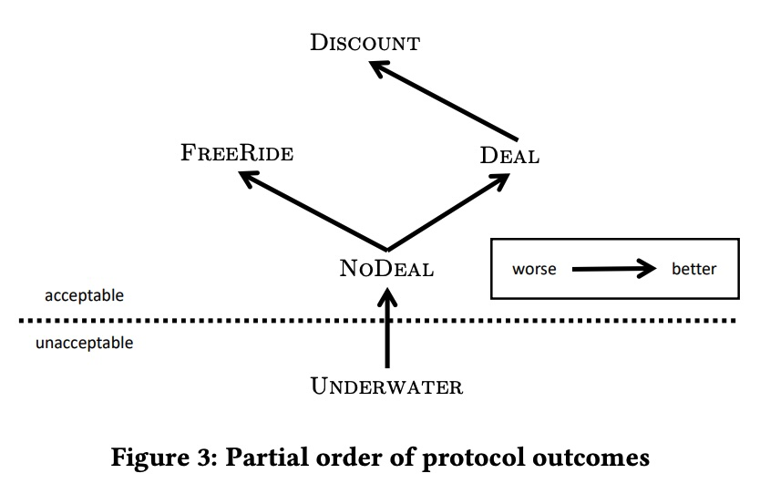
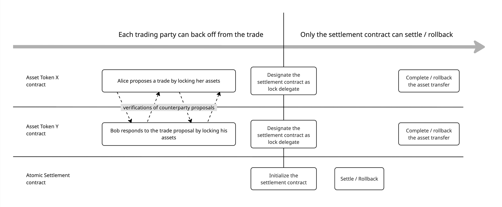
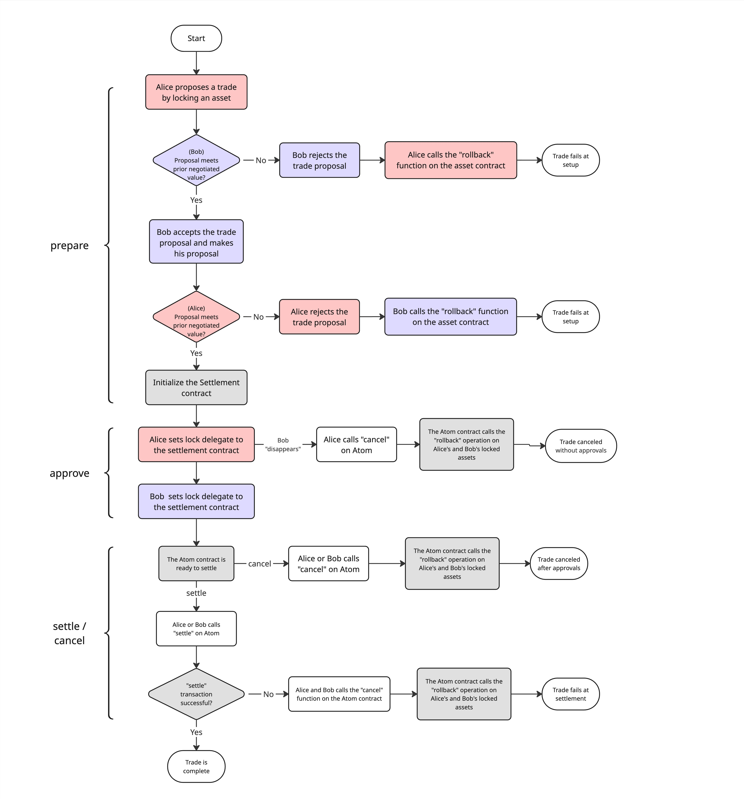
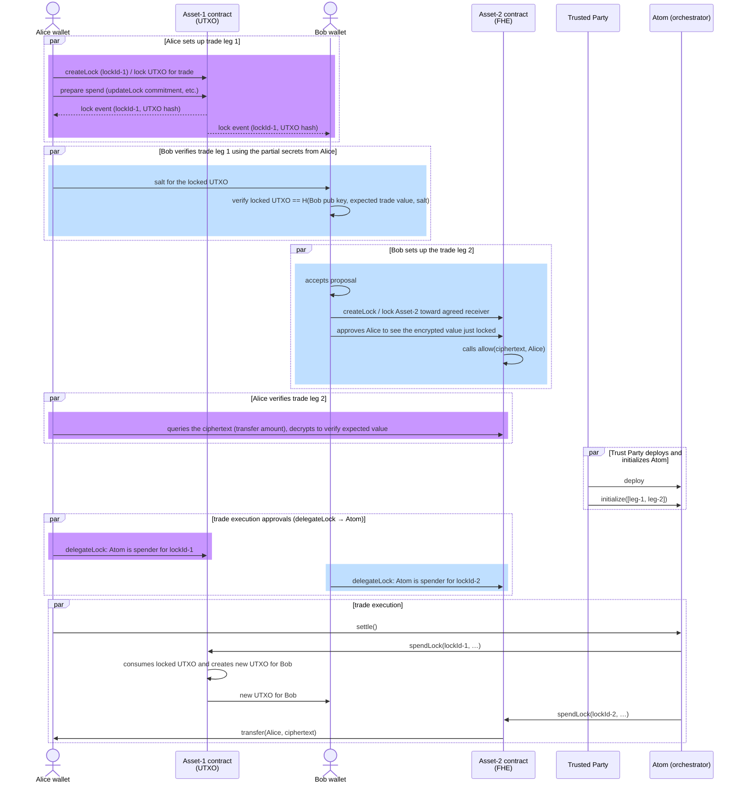
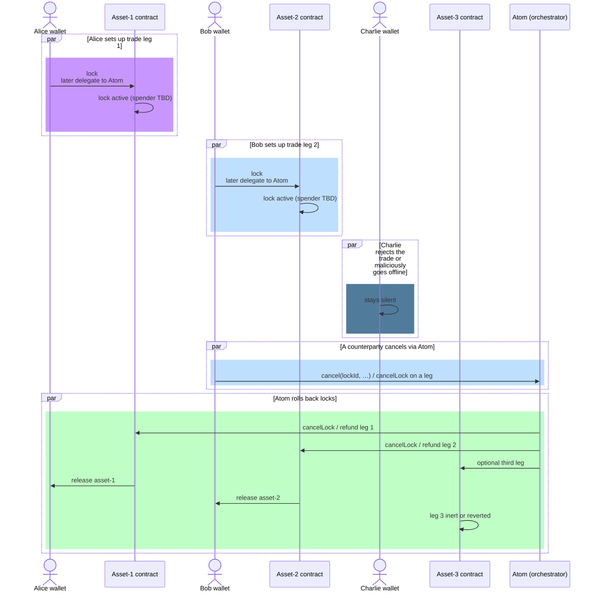
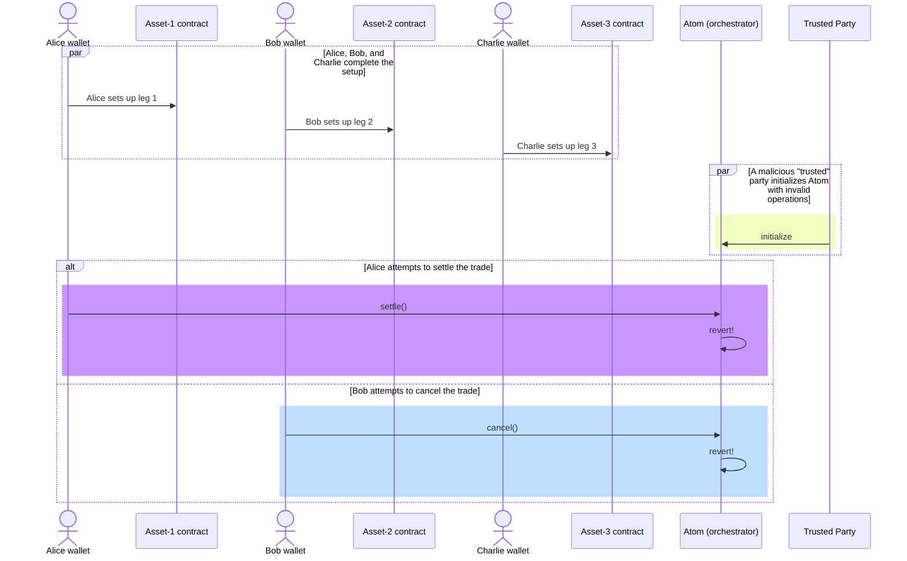

# Secure Multi-leg Atomic Settlements of Privacy Enhancing Tokens

## Table of Contents

- [The Privacy Enhancing Tokens Landscape](#the-privacy-enhancing-tokens-landscape)
  - [Homomorphic Encryption based Tokens](#homomorphic-encryption-based-tokens)
  - [Commitment based Tokens](#commitment-based-tokens)
    - [Hash (non-homomorphic) based Commitments](#hash-non-homomorphic-based-commitments)
    - [Homomorphic Commitments](#homomorphic-commitments)
- [Atomic Settlements — protocol design](#atomic-settlements-between-privacy-tokens---protocol-design)
- [Atomic Settlements — demonstrations](#atomic-settlements-between-privacy-tokens---demonstrations)
  - [Lock interfaces for the privacy tokens](#lock-interfaces-for-the-privacy-tokens)
  - [Generic lock interface](#generic-lock-interface)
  - [Settlement orchestration contract](#settlement-orchestration-contract)
  - [Successful Settlement Flow #1 - Confidential ERC20 vs. Confidential UTXO](#successful-settlement-flow-1---confidential-erc20-vs-confidential-utxo)
  - [Failure case #1 - counterparty fails to fulfill obligations during setup phase](#failure-case-1---counterparty-fails-to-fulfill-obligations-during-setup-phase)
  - [Failure case #2 - a malicious party attempting to initialize with invalid Operations](#failure-case-2---a-malicious-party-attempting-to-initialize-with-invalid-operations)

This document describes a **protocol** (and reference implementation) for performing multi-leg settlements among an arbitrary number of privacy-enhancing tokens in a secure and atomic manner. It is not an official Ethereum ERC/EIP track document unless separately published as such.

## The Privacy Enhancing Tokens Landscape

A number of privacy enhancing token designs exist in the Ethereum ecosystem today. The following material is designed to accommodate different styles of privacy token designs. Below we briefly review the two mainstream designs of privacy enhancing tokens, along with some influential implementations for each.

### Homomorphic Encryption based Tokens

This category of tokens protects the confidentiality of onchain states and transaction payloads through encryption. In particular, homomorphic encryption enables operations to be performed onchain against the states. These encryption schemes allow smart contracts to operate on ciphertexts and, more importantly, to enforce spending policies such as mass conservation and non-negative balances, purely through onchain components.

> We are using the term "onchain components" above in a loose sense. Some essential components like the co-processor for performing the computation-intensive FHE operations may be considered trusted offchain components. But given they are part of the "protocol" setup, rather than requiring client-side or wallet-side components like is the case with commitment-based tokens, we call them "onchain components" for brevity.

This category of tokens typically uses an account model for managing onchain states, where a map of account addresses and encrypted balances is maintained by the token contract.

The encryption scheme must be a fully homomorphic encryption (FHE) system, to support all the necessary operations onchain, including arithmetic comparisons that are crucial to enforce token spending policies, without requiring clients to submit proofs of correct encryption.

Implementations of encryption based tokens include:

- OpenZeppelin’s [ERC7984 implementation](https://github.com/OpenZeppelin/openzeppelin-confidential-contracts/tree/master/contracts/token)
- Inco's [Confidential ERC20 framework](https://github.com/Inco-fhevm/confidential-erc20-framework/tree/main), in collaboration with Circle Research
- Fhenix's [FHERC20](https://github.com/FhenixProtocol/fhenix-contracts/blob/main/contracts/experimental/token/FHERC20/FHERC20.sol)

The samples in this repo are built with the 1st implementation on the list above.

### Commitment based Tokens

This category of tokens protect the confidentiality of the onchain states and transaction payloads by using commitments. The commitments represent the onchain states either with hashing or encryption. When processing transactions, the smart contract relies either completely or partially on a ZKP submitted by the sender to guarantee correctness of the state transitions.

#### Hash (non-homomorphic) based Commitments

If the commitments are based on hashes, no operations can be performed on the commitments during state transition. The smart contract must completely rely on a ZKP submitted by the transaction sender to verify if the state transitions are proposed correctly, obeying all spending rules such as mass conservation and entitlement.

Due to the disjoint nature of the commitments, the state model is inevitably **UTXO** (Unspent Transaction Output) based. This model has the advantage of supporting parallel processing, where the same spending account can submit many transactions simultaneously, each consuming a different collection of the account's UTXOs. This means these tokens do not suffer from the concurrent spending limits that tokens based on homomorphic commitments (described below) do.

Many privacy tokens fit in this category, including:

- Zcash
- Railgun
- Aztec
- [Paladin](https://github.com/LFDT-Paladin/Paladin)’s [Noto](https://github.com/LFDT-Paladin/Paladin/tree/main/solidity/domains/noto) and [Zeto](https://github.com/LFDT-Paladin/zeto) tokens

The samples in this repository are built with the Zeto token implementation.

#### Homomorphic Commitments

If the commitments are based on additive homomorphic encryption, or homomorphic commitment (such as Pedersen commitment), the smart contract can perform additions on the commitments. However, the smart contract must still rely on ZKPs to guarantee correctness of the calculated commitments, such as mass conservation and entitlement. The homomorphic property of the commitment scheme makes it possible to "roll up" all the state commitments for an account to a single commitment, rather than staying as individual commitments, thus resulting in more efficient storage usage. However, these token designs suffer from limited throughput due to the concurrency requirement between the proof-generating client and the onchain verification logic.

Examples include:

- [Zether](https://github.com/Consensys/anonymous-zether), based on additively homomorphic encryption with ElGamal
- Solana's [Confidential Transfer](https://www.solana-program.com/docs/confidential-balances), based on Pedersen commitments
- Avalanche's [Encrypted ERC-20](https://github.com/ava-labs/EncryptedERC), based on a custom partially homomorphic encryption scheme

## Atomic Settlements Between Privacy Tokens - Protocol Design

To properly design the protocol that meets security requirements, we use the model from the well-known paper [_Atomic Cross-Chain Swaps_](https://arxiv.org/pdf/1801.09515). Even though the model was created for cross-chain swap protocols, the same model can be applied to same-chain swap protocols discussed here.

The protocol's possible outcomes are illustrated below:



- Deal: The party swaps assets as expected. This is the most desired outcome (for all parties that intend to conform to the protocol).
- NoDeal: No assets change hands.
- FreeRide: The party acquires assets without paying.
- Discount: The party acquires assets while paying less than expected.
- Underwater: The party pays without acquiring all expected assets.

We want to design the protocol so that unacceptable outcomes, where any party is left underwater, should not be possible.

A core part of our design is an orchestrator contract that guarantees the outcomes of the flows by deterministically codifying the various scenarios for both **Deal** and **NoDeal**.

In almost all cases, FreeRide or Discount outcomes are only possible for some parties with other parties suffering Underwater outcomes, so the protocol should not support either of these outcomes.

An important observation is that the hash locks are not needed in the same-chain settlements we are focusing on here. The hashlocks are proposed in the paper above as the synchronous coordination mechanism due to the lack of single-chain atomic execution guarantee.

The time lock proposed in the paper serves the purpose of providing an exception mechanism in the case of "disappearing counterparty", to prevent a party's locked asset from being stuck indefinitely if the counterparty failed to fulfill their protocol responsibilities. The "disappearing counterparty" risk still exists in the same-chain protocol, but whether the time lock is needed or not depends on if the protocol requires a multi-step process that creates inter-counterparty dependencies (Alice locks her asset, and _requires_ Bob to do something to execute or refund).

A high level protocol illustration:



- The protocol has two phases: preparation and execution
- Preparation: each party presents their trade proposal by locking up assets and verifying the counterparty's locked assets. During this phase, each party is free to back up from the trade by unblocking the assets and get the refund
- To transition to the next phase, the trading parties must prepare their operations to use to initialize the settlement contract, and signal their final approvals by moving the lock delegate to the settlement contract (so that only the settlement contract can unlock the assets)
- Execution: once in this phase, no trading parties can unilaterally walk away from the trade any longer. To unlock the assets for settlement or rollback, the settlement contract must call the asset token contract as the current lock delegate.

Below is a more detailed illustration of the steps involved in the protocol:



## Atomic Settlements Between Privacy Tokens - demonstrations

To demonstrate atomic settlements among privacy tokens, exemplary implementations are selected to match the major design patterns in the privacy-enhancing token landscape, as described above.

- **UTXO / commitment (Zeto):** LFDT [Zeto](https://github.com/LFDT-Paladin/zeto) (`IZetoLockableCapability` in the `zeto-solidity` dependency), used with this repo’s `ILockableConfidentialUTXO` facade.
- **FHE / account, lockable (confidential ERC-20):** OpenZeppelin-style confidential ERC-20 with `FheERC20Lockable` and `ILockableConfidentialERC20` (see [test/c-erc20-with-locking_vs_zeto.ts](./test/c-erc20-with-locking_vs_zeto.ts)).
- **Cleartext ERC-20, lockable:** `ERC20Lockable` and `ILockableERC20` (same `ILockableCapability` lifecycle, `uint256` amount in `createArgs`; see [test/erc20-with-locking_vs_zeto.ts](./test/erc20-with-locking_vs_zeto.ts)).
- **FHE / account, non-locking (IERC7984 only):** base confidential transfer into `Atom` without a full lock leg on the FHE side (see [test/c-erc20_vs_zeto.ts](./test/c-erc20_vs_zeto.ts)).

In principle, the same orchestration applies to more pairings (e.g. confidential ERC-20 vs. confidential ERC-20, or Zeto vs. Zeto) when both sides expose the lock API and compatible `spendArgs`.

The examples in this repository show that **a generic locking-based settlement mechanism** can support these patterns in multi-leg atomic flows (with `Atom` as the reference orchestrator).

### Lock interfaces for the privacy tokens

The repository contains the following smart contract interfaces (or facades) that line up with the lock lifecycle for the reference tests:

- **`ILockableCapability` (canonical definition):** maintained in the [Paladin](https://github.com/LFDT-Paladin/Paladin) repository. The [Zeto / `zeto-solidity`](https://github.com/LFDT-Paladin/zeto) package that this project depends on includes a **mirrored copy** of the same interface (and related types) for **dependency and packaging reasons**, not as a second source of truth. Implementations should stay aligned with the Paladin definition.

- `ILockableConfidentialERC20` (see `contracts/api/ILockableConfidentialERC20.sol`): a thin domain extension of `ILockableCapability` (as imported from `zeto-solidity`) for FHE (account) tokens. A lock is created with `createLock(bytes,bytes32,bytes32,bytes) returns (bytes32 lockId)` using ABI-encoded {ConfidentialErc20CreateLockArgs} (unique `txId`, `receiver`, encrypted `amount` handle, FHE `amountProof`). The current authorised actor is the `spender` in {ILockableCapability.LockInfo}; the implementation emits `LockCreated` and `ConfidentialErc20LockState` (with the ciphertext) for off-chain review.

- `ILockableERC20` (see `contracts/api/ILockableERC20.sol`): same generic lifecycle for **cleartext** ERC-20 amounts—`Erc20CreateLockArgs` uses `uint256 amount` and no FHE proof. Implemented by `ERC20Lockable` in `contracts/deps/ERC20Lockable.sol`; emits `Erc20LockState` alongside `LockCreated`.

- `ILockableConfidentialUTXO` (see `contracts/api/ILockableConfidentialUTXO.sol`): extends `IZetoLockableCapability` from `zeto-solidity` (which mirrors the Paladin/Zeto UTXO lock API). Typed `ZetoCreateLockArgs` / `ZetoSpendLockArgs` and helper hashes are documented alongside `IZetoLockableCapability` in the Zeto package (e.g. deterministic `lockId` from `keccak256(abi.encode(address(this), msg.sender, txId))`).

```solidity
// Generic lifecycle; see ILockableCapability
function createLock(bytes calldata createArgs, bytes32 spendCommitment, bytes32 cancelCommitment, bytes calldata data) external returns (bytes32 lockId);
function updateLock(bytes32 lockId, bytes calldata updateArgs, bytes32 spendCommitment, bytes32 cancelCommitment, bytes calldata data) external;
function delegateLock(bytes32 lockId, bytes calldata delegateArgs, address newSpender, bytes calldata data) external;
function spendLock(bytes32 lockId, bytes calldata spendArgs, bytes calldata data) external;
function cancelLock(bytes32 lockId, bytes calldata cancelArgs, bytes calldata data) external;
// … and views: getLock, isLockActive, getLockContent, computeLockId
```

There are slight differences in the function signature due to the different onchain state model used by account-based tokens vs. UTXO-based tokens. But the locking mechanism is the same and works as follows:

- A lock is considered **ready for inspection** when the value is locked, spend/cancel commitments (if used) are published via `updateLock` (optional when commitments stay zero), and a current `spender` is chosen who may execute `spendLock` or `cancelLock`. A counterparty should check on-chain {getLock} / {getLockContent} (or domain events such as {ZetoLockCreated} or {ConfidentialErc20LockState}) to validate the terms.
  - `createLock`: materialises the lock and, for Zeto, consumes UTXO inputs to produce `lockedOutputs`; the lock id is usually predictable via `computeLockId`.
  - `updateLock`: (when the lock is still *owner-controlled*, `spender == owner` in the generic {LockInfo}) rewrites the spend and cancel `bytes32` commitments, binding the off-chain expected settlement and refund parameters.
  - `delegateLock`: reassigns the *spender* (formerly called “delegate” in the older narrative) to another account—typically the atomic settlement / Atom contract—using implementation-specific `delegateArgs` and replay-guarding `txId` fields where required.
- A lock is implemented so that, while active, funds cannot be moved except by the current spender, via the generic `spendLock` (settle) or `cancelLock` (refund) paths, subject to token-specific ZK and commitment checks.
- A counterparty reads spend commitments (and optional cancel commitments) to confirm that a proposed future `spendLock` / `cancelLock` is tied to the agreed outputs; secret details may still require out-of-band disclosure.

### Generic lock interface

The account and UTXO facades above (including `ILockableERC20`) all align with the shared **`ILockableCapability`** API. The **authoritative** interface is defined in **Paladin**; this repository compiles against the **copy** in `zeto-solidity/contracts/lib/interfaces/ILockableCapability.sol`. It is the **minimal generic lifecycle** for a lock: create, optional update, delegate, then **spend** (settle) or **cancel** (refund). The orchestrator, **`Atom`**, type-erases the implementation-specific `spendArgs` and `cancelArgs` as `bytes` and forwards them to `spendLock` and `cancelLock` respectively.

```solidity
function spendLock(bytes32 lockId, bytes calldata spendArgs, bytes calldata data) external;
function cancelLock(bytes32 lockId, bytes calldata cancelArgs, bytes calldata data) external;
```

Token-specific structs (Zeto: `ZetoSpendLockArgs`; FHE / cleartext lockable ERC-20: often empty `spendArgs` in the reference v1) are `abi.encode`’d by clients before calling. Legacy names `unlock` and `rollbackLock` map to `spendLock` and `cancelLock`.

### Settlement orchestration contract

Finally, a settlement orchestration contract implementation, `Atom`, is provided. The Atom contract must be initialized once with all the legs of the settlement, with each leg represented by an `Operation` object.

```solidity
function initialize(Operation[] memory _ops) external initializedOnlyOnce onlyOwner
```

The `initialize()` function is the one-time opportunity to put the different legs of a settlement in the contract. This is designed for security reasons: otherwise, we do not know what the expected list of participants in the trade is, and as such cannot prevent a random party (with malicious intent) from appending an invalid Operation and invalidating the setup.

This design assumes that necessary negotiations and orchestrations will happen ahead of time, with each of the trading participants having verified the setup of the locks in the relevant token contracts. A trusted party can then call the `initialize()` function on behalf of all the trading participants. The trusted party can either be a smart contract or an externally owned account (EOA) held by a mutually trusted entity.

After the `initialize()` call, each of the trading parties must review the initialized `Operation` entries: `lockId`, `approver`, and the pre-encoded `spendArgs` bytes that the Atom will pass to `spendLock` at settlement. Then they signal their approval, typically by calling `delegateLock` on the token to install the settlement contract as the current *spender* for that `lockId`. Only after the agreed approvals (this repository’s `Atom` uses approvers as the counterparties) should the `settle()` function be executed.

While the Atom is still `Pending`, a party may need to **cancel** (rollback) a leg if the other side never approves. In the reference `Atom` contract, `settle()` and `cancel()` are both gated by `onlyCounterparty`: the caller must be one of the configured `Operation.approver` addresses (typically the counterparty(ies) for each leg). So **arbitrary third parties** cannot invoke `cancel`; only the designated approvers can. `cancel` remains available before successful `settle` so an approver is not held hostage by a silent counterparty, subject to the rules of your deployment.

### Successful Settlement Flow #1 - Confidential ERC20 vs. Confidential UTXO

The diagram below illustrates a full settlement flow for two trading participants: Alice (confidential UTXO) and Bob (confidential FHE ERC-20). **Atom** is the **settlement / orchestration** contract. Asset contracts are the `ILockableCapability` implementations (Zeto and the FHE ERC-20 in this example), not necessarily a single classic escrow vault holding all asset types in every model.



### Failure case #1 - counterparty fails to fulfill obligations during setup phase

The locking mechanism must have safety features that protect against the following failure scenarios. A failure scenario can either be due to an intentional decision against the proposal, or malicious action to fail to fulfill required obligations.

Because this mechanism focuses on intra-chain settlements only, meaning all the target tokens are deployed on the same chain, the risks are all in the setup phase, where each counterparty is expected to fulfill their side of the bargain obligation. Once the setup is complete and approved, the final settlement happens atomically, guaranteed by the underlying blockchain protocol.

The diagram below is a **generic** illustration with **three** legs (Alice, Bob, Charlie) where one party never completes setup. The tests in this repository often use **two** parties only—for example, Alice creates her UTXO lock but Bob never creates an on-chain FHE lock; Alice can then `cancelLock` (or, after `Atom` is wired, cancel via the orchestrator) without settling.



### Failure case #2 - a malicious party attempting to initialize with invalid Operations

A malicious party can **`initialize` Atom** (or a similar orchestrator) with a malformed `Operation`, such that later calls to `settle()` or `cancel()` always revert. In the worst case, honest parties' locks remain bound to an unusable workflow—hence the importance of one-time, trusted `initialize`, review of pre-encoded `spendArgs` / `lockId`s, and the mitigations below.



To guard against this case (see also [contracts/Atom.sol](contracts/Atom.sol)):

- The reference `Atom`’s `cancel()` wraps downstream `cancelLock()` calls in `try`/`catch` so a **malicious lock** on one leg does not block another leg’s `cancelLock` and emitted rollback events, reducing “all-or-nothing stuck” failure from *bad lock code* on a single leg.
- Operational controls (reviewing `initialize` parameters, `onlyOwner` on `initialize`, and approver roles) still matter when *Atom itself* is misconfigured, because on-chain recourse may be limited.
