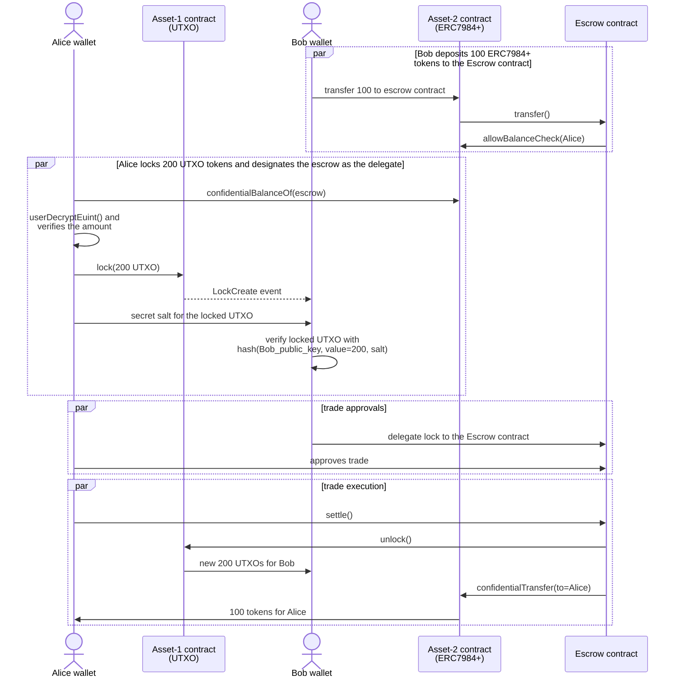

# Secure Atomic Settlements Between Confidential ERC20 and ILockable privacy tokens

This document describes how to perform secure atomic settlements (swaps) between a vanilla [Confidential ERC20](https://github.com/OpenZeppelin/openzeppelin-confidential-contracts/tree/master/contracts/token/ERC7984) token, a.k.a ERC7984, and a privacy token that implements the [ILockable](./contracts/api/ILockable.sol) interface.

Because the ERC7984 token does not have a locking mechanism, the promised trade value is transferred to the escrow contract that performs the orchestration of the swap. The escrow contract will transfer the value to the target receiver during the atomic settlement.

To facilitate for the trading counterparty to verify the commitment for the trade, an interface [IConfidentialBalanceCheck](./contracts/deps/interfaces/IConfidentialBalanceCheck.sol) is recommended as a simple extension to the ERC7984 token implementation. This enables the escrow contract to allow the trade counterparty to peek into the committed balance that has been transferred to the escrow contract, before committing the corresponding trade leg and approving the settlement to proceed.

```solidity
interface IConfidentialBalanceCheck {
    function allowBalanceCheck(address spender) external;
}
```

## Successful settlement

The following sequence diagram describes the steps taken by the two trading parties, one using an ERC7984 token enhanced with the `IConfidentialBalanceCheck` interface, one using a Zeto token which implements a locking mechanism based on the `ILockable` interface.


